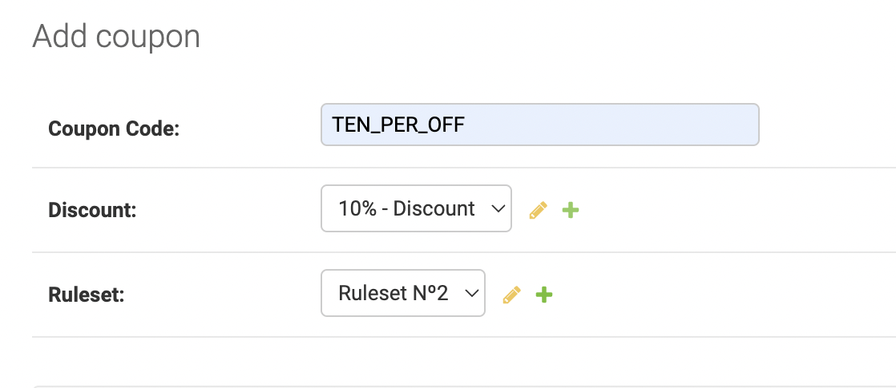

## Coupon Rule Based Engine ###

This app is built to create a flexible system for coupon creation for any ecommerce product.
This app attempts to support the popular coupon types used by any/all websites today.
It does so by using a concept called <b>RuleSets  </b>. These makes addition of new coupon types easy and affordable to change.

When you create a coupon, you specify 3 following things:


Every coupon has to satisfy three basic properties to be valid:
* Validity RuleSet - specifies duration during which a coupon is valid
* Allowed Users Ruleset - specifies users/user groups eligible for the coupons
* Max Uses - specifies the total permissible uses of a coupon and uses per user

The other rulesets are optional and support creation of various coupon types. You can add more rulesets and incorporate the corresponding logic in the `couponrules` module.

### Some Sample Coupons created using Rulesets

1. FLAT100OFF gives you 100Rs off on your purchase. 
2. NEWUSER50 gives you 50% off on your first purchase.
3. LIGHTNING_DEAL lets you choose specific days of the week and the hour you want coupon to be valid. For eg, the LIGHTNING_DEAL can be valid only on Monday & Tuesday from 4-5pm. 
4. FREE_SHIPPING coupon gives free shipping to the customer. For eg, during Big Billion Day Sale, you want to give user Free shippping for that week.
5. OMG_SAMPLES coupon gives free samples above a threshold amount
6. LOYALTY_50_OFF coupon gives flat 50Rs off over the threshold amount you specify in the portal.
7. You can also combine coupons. For eg, if you want to give free shipping if your loyalty points exceed a threshold, you can enable those rulesets while coupon creation.
8. This library helps to setup BOGO Coupons. Buy One Get One free offers for products.

### Setup and testing

The first thing to do is to clone the repository:

```sh
$ git clone https://github.com/poorvaparkhi/coupons.git
$ cd coupons
```

Create a virtual environment to install dependencies in and activate it:

```sh
$ virtualenv2 --no-site-packages venv
$ source venv/bin/activate
```

Then install the dependencies:

```sh
(env)$ pip install -r requirements.txt
```
Note the `(venv)` in front of the prompt. This indicates that this terminal
session operates in a virtual environment set up by `virtualenv2`.

Once `pip` has finished downloading the dependencies:
```sh
(venv)$ cd coupons
(venv)$ python3 manage.py runserver
```
And navigate to `http://127.0.0.1:8000/admin`.
